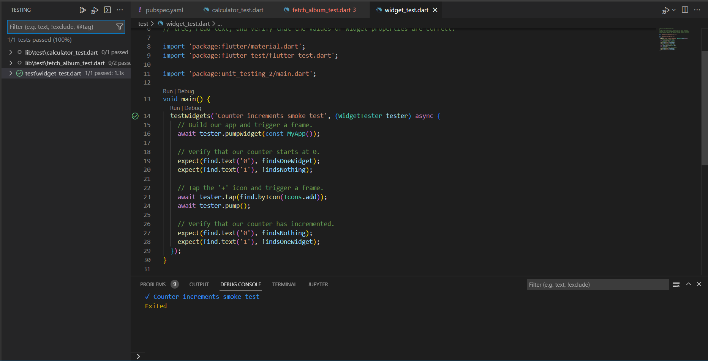
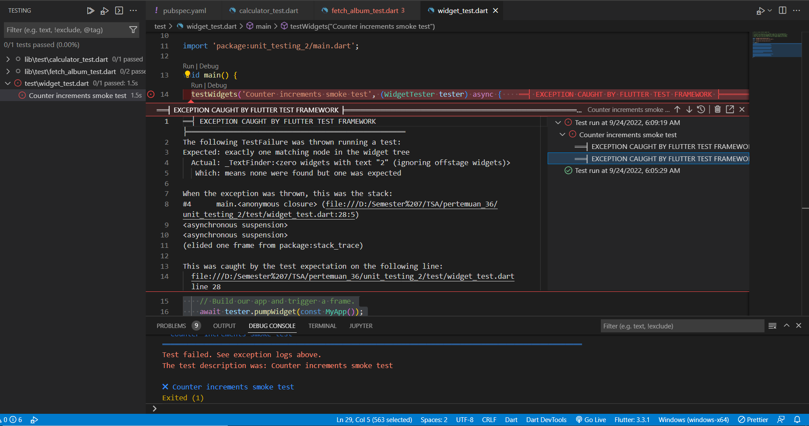
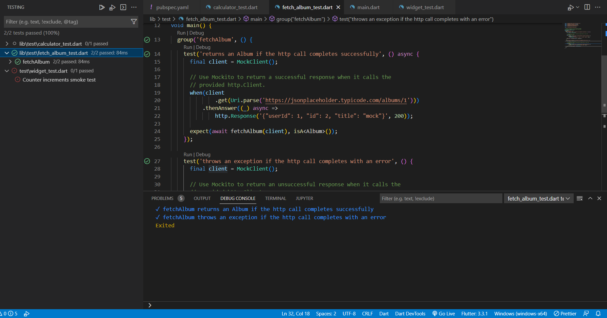

# unit_testing_2

1. Eksekusi Widget Testing 
2. Eksekusi Widget Testing gagal kareana kondisi Diubah pada saat ditekan Icon.add bernilai 2 daripada 1 untuk matcher findsOneWidget 
3. Eksekusi Widget Testing fetch album 

